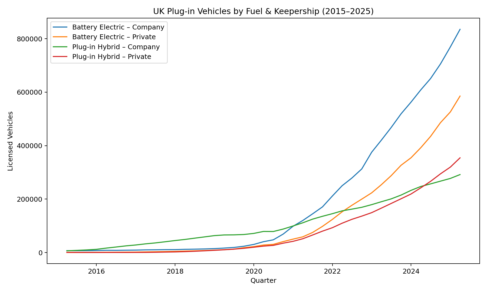

# 🚗 Fleet EV Trend Analyzer (UK PiVs, 2015–2025)

[](https://www.python.org/)
[](https://pandas.pydata.org/)
[](https://matplotlib.org/)
[](https://www.gov.uk/government/statistical-data-sets/vehicle-licensing-statistics-data-files)
[](#)

This project automates analysis of UK licensed plug-in vehicles (PiVs) using the Department for Transport dataset [`df_VEH0145`](https://www.gov.uk/government/statistical-data-sets/vehicle-licensing-statistics-data-files).  

It filters **Battery Electric vs Plug-in Hybrid**, splits **Company vs Private keepership**, cleans the data, and produces:

- 📊 `cleaned_ev_timeseries.csv` — long-form quarterly data (2015–2025)  
- 📈 `EV_growth.png` — chart of adoption trends  
- 📝 `report.txt` — executive-style summary with growth rates, company share, and implications for fleet finance  

---

## 🔑 Key Insights (2015Q1 → 2025Q1)

- **Battery Electric (Company):** 7,030 → 835,141 vehicles (+11,780%)  
- **Battery Electric (Private):** 575 → 583,592 vehicles (+101,000%)  
- **Plug-in Hybrid (Company):** 6,572 → 29,175 vehicles (+439%)  
- **Plug-in Hybrid (Private):** 542 → 354,370 vehicles (+65,282%)  
- **Company-kept share (latest quarter):** **54.5%** of all UK plug-in vehicles  

### 💡 Implications for Fleet & Finance
- 🚀 Explosive BEV growth raises exposure to **EV residual value risks** — critical in leasing profitability.  
- 🏢 Company-kept dominance confirms **fleet electrification is accelerating**, reshaping pricing and product design.  
- 📆 Quarterly data enables **remarketing timelines and maintenance planning**.  

---

## 🖼️ Visual Output

<p align="center">
  
</p>

---

## ⚙️ How to Run

1. Clone this repo & download the `df_VEH0145` CSV (Licensed plug-in vehicles by quarter) from the [DfT site](https://www.gov.uk/government/statistical-data-sets/vehicle-licensing-statistics-data-files).  
2. Install requirements:  
   ```bash
   pip install -r requirements.txt
````

3. Run the script:

   ```bash
   python3 ev_trends.py /path/to/df_VEH0145.csv
   ```
4. Outputs:

   * `cleaned_ev_timeseries.csv`
   * `EV_growth.png`
   * `report.txt`

---

## 🎯 Why This Matters

This project demonstrates **finance automation applied to real automotive datasets**.

It mirrors how **Zenith’s Finance Automation Analysts** use technology to turn messy datasets into actionable insights for decision-making in **fleet leasing and electrification**.

---

## 📌 Tech Stack

* Python 3.10+
* Pandas 2.x
* Matplotlib 3.x

---

## 👤 Author

**Giuseppe**
[](https://github.com/Giuseppe552)
[](https://www.linkedin.com/in/Giuseppe552/)

```

---


