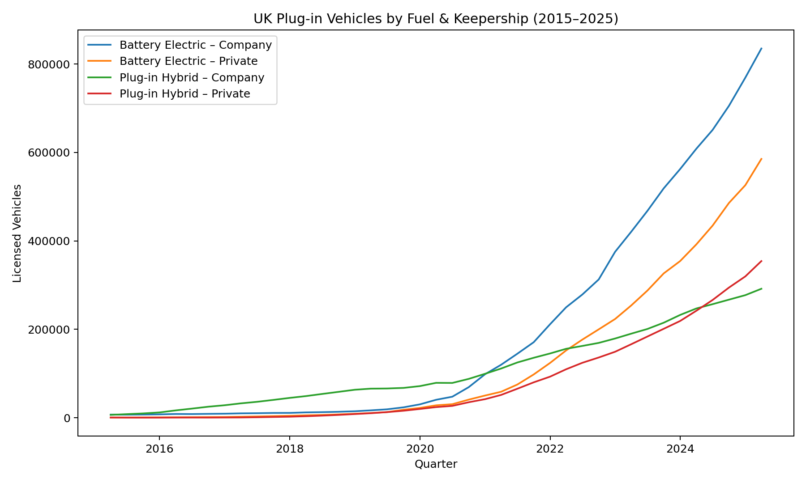

# 🚗 Fleet EV Finance Analyzer

---

## 📌 Overview

This repository demonstrates how **automation and analytics can solve real problems in fleet finance**.  
It is structured into two phases:

1. **[Phase 1 — EV Trend Analyzer](./phase1):**  
   Cleans and analyzes official UK government data (`DfT df_VEH0145`) to quantify adoption of plug-in vehicles (PiVs).  
   Breaks down **Battery Electric vs Plug-in Hybrid** and **Company vs Private** keepership.  
   Outputs long-term growth trends and fleet electrification insights.

2. **[Phase 2 — EV Residual Value Risk Simulator](./phase2):**  
   Models depreciation curves for popular EVs using used-car listing data.  
   Simulates residual value (RV) exposure at 36/48/60 months under **base, optimistic, conservative, and stress** scenarios.  
   Produces risk dashboards (CSV, charts, executive summary).  

---

## 📊 Phase 1 — EV Trend Analyzer (2015 → 2025)
👉 [Explore Phase 1](./phase1)  

  

**Key insight:** Fleet-kept BEVs now represent **>50% of UK plug-in vehicles**, confirming leasing portfolios are at the center of the EV transition.

---

## 📉 Phase 2 — EV Residual Value Risk Simulator
👉 [Explore Phase 2](./phase2)  

  

**Key insight:** Residual values drive leasing profitability. This simulator shows how a **10–20% downside in resale prices** can erase margins — making RV risk the *profit lever* for fleet finance.

---

## 🚀 Why This Matters

- **Phase 1:** Proves electrification is surging, exposing fleets to EV dynamics.  
- **Phase 2:** Quantifies RV risk, enabling finance teams to stress-test margins.  

Together, these phases demonstrate how raw data can be turned into **finance-ready insights** that directly support strategic decision-making in leasing.

---

## 🔧 How to Run

- Phase 1 instructions → [here](./phase1)  
- Phase 2 instructions → [here](./phase2)  

Clone the repo, install dependencies per phase, and run the scripts to reproduce outputs.

---

## 📎 At a Glance
- **Data:** UK Department for Transport + synthetic EV listing generator  
- **Tools:** Python (pandas, matplotlib), automation workflows  
- **Focus:** Adoption trends, residual value risk, fleet electrification economics  
