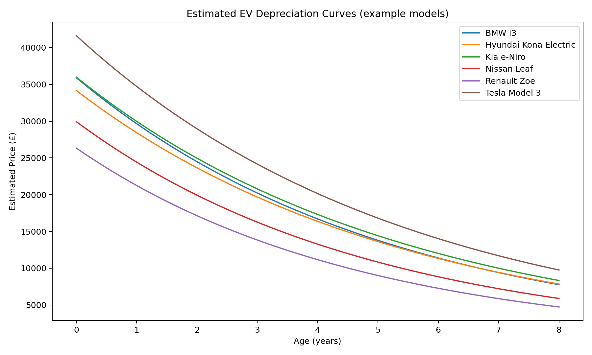

# 🚗 Fleet EV Finance Analyzer

**Business context:** This repo shows how automation + analytics support fleet finance.
- **Phase 1:** UK plug-in vehicle adoption by fuel (BEV/PHEV) and keepership (Company/Private) using DfT `df_VEH0145`.
- **Phase 2:** Residual value (RV) risk simulation with depreciation curves and base/optimistic/conservative/stress scenarios.

---

## 📊 Phase 1 — EV Trend Analyzer (UK PiVs, 2015–2025)
👉 See **[phase1/](./phase1)**  

## 📉 Phase 2 — EV Residual Value Risk Simulator
👉 See **[phase2/](./phase2)**  

---

## Why This Matters
- Phase 1 proves fleet electrification is surging → rising exposure.
- Phase 2 models the **profit lever in leasing**: residual values and downside risk.

## Run Instructions
Follow the READMEs inside [phase1/](./phase1) and [phase2/](./phase2).
