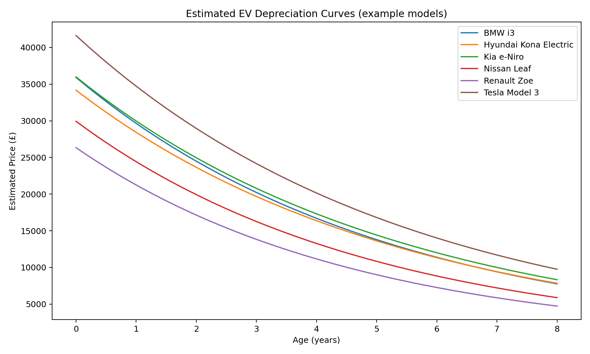

# Phase 2 — EV Residual Value Risk Simulator

Goal: model depreciation curves for popular EV models and simulate residual value (RV) exposure at 36/48/60 months.  
Inputs: used EV listings (Make, Model, Year, Mileage, AskingPrice).  
Outputs:
- `rv_forecasts.csv` — expected residual value at lease end for each (Make, Model, Year, Mileage bucket)
- `depreciation_curves.png` — model-level depreciation chart
- `rv_report.txt` — summary of exposure vs conservative/base/optimistic scenarios

How to run:
1) Place your CSV as `data/ev_used_listings.csv` with columns:
   `Make,Model,Year,FirstRegDate,Mileage,AskingPrice`
2) Install deps: `pip install -r requirements.txt`
3) Run: `python3 residual_risk.py data/ev_used_listings.csv`

## Outputs (example)

  

